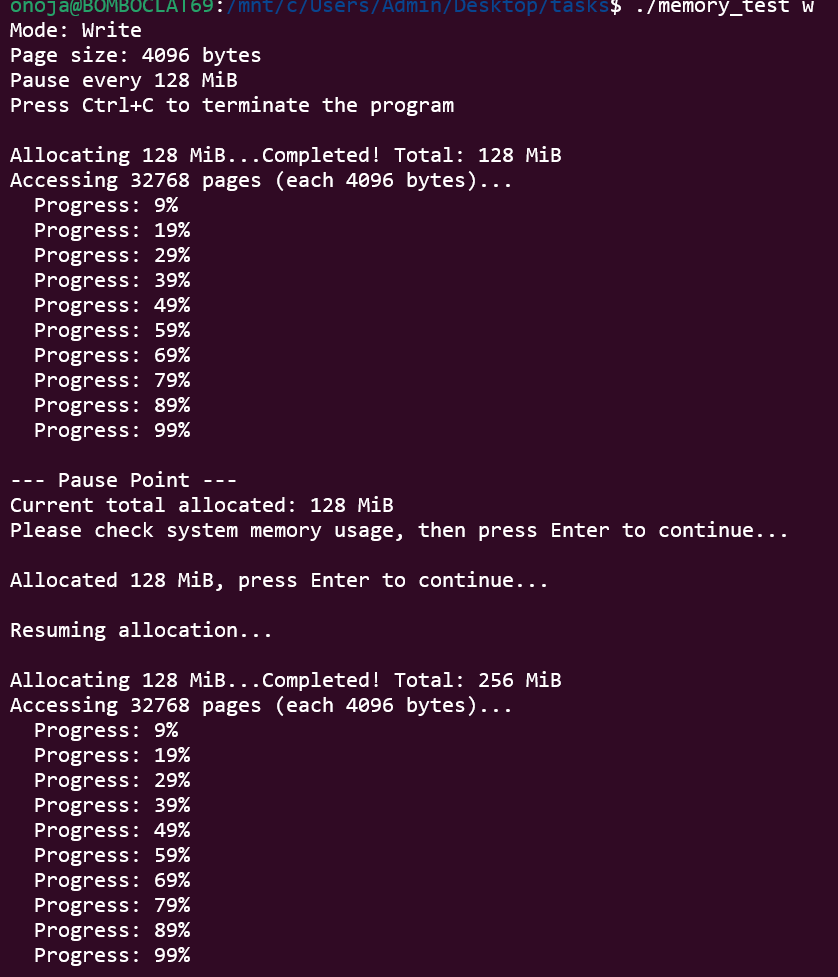
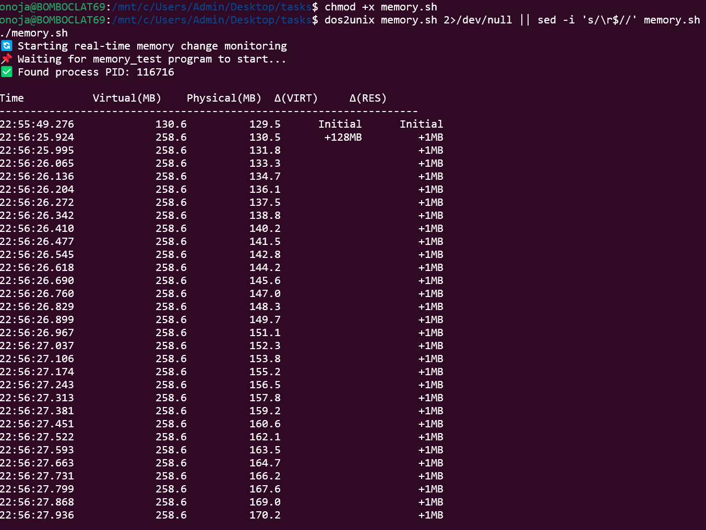
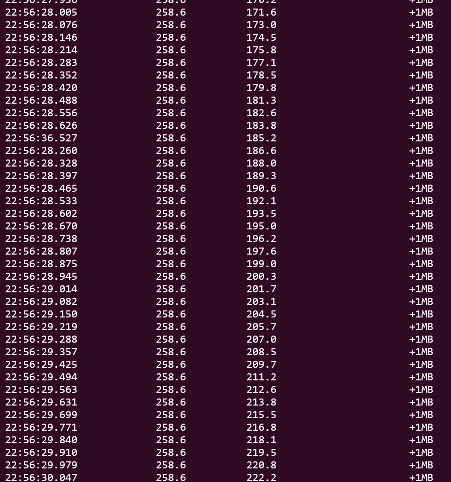

# Отчет о тестировании поведения распределения виртуальной и физической памяти
Проверяем влияния различных режимов доступа (чтение/запись) на занимаемый объем физической памяти при распределении памяти с использованием функции `malloc()`. Тестирование проводилось в сравнительном режиме: в среде Linux и в имитационной среде Windows, запущенной через Wine.
#### Аппаратная среда
 - CPU: 11th Gen Intel(R) Core(TM) i5-11400H @ 2.70GHz (2.69 GHz)
 
 - memory: 16GiB

# Шаги
1.Запускать программу соответственно в режимах `r` (чтение) и `w` (запись)

2.Наблюдать за состоянием использования памяти в инструменте мониторинга системы

3.Записывать изменения физической памяти и виртуальной памяти

4.Приостанавливать процесс после каждого распределения 128 MiB памяти и фиксировать полученные результаты наблюдения

- Размер страницы: 4 КБ

- Шаг распределения: 128 МБ

- Настройка задержки: 100 микросекунд на доступ к странице

- Максимальное распределение: 4 ГБ


# Результаты тестирования системы Linux
>  Ubuntu 24.04.1 LTS

Напишем shell-скрипт для отслеживания изменений в виртуальной и физической памяти в режиме реального времени!!(memory.sh)

### Read

Запустить нашу программу после запуска скрипта

```shell
 ./memory.sh
 ```

```shell
./memory_test r
```


##### Write

```shell
 ./memory.sh
```

```shell
./memory_test w
```





#### Результаты тестирования системы Windows через Wine

> Windows 11

Точно так же напишем shell-скрипт для отслеживания изменений в виртуальной и физической памяти в режиме реального времени!!([wine_monitor.sh](wine_monitor.sh))

##### Read

Компиляция исполняемых файлов Windows в Linux:

```shell
 x86_64-w64-mingw32-gcc -o memory_test.exe memory.c
```

Запустить нашу программу после запуска скрипта

```shell
./wine_monitor.sh
```

```shell
 wine ./memory_test.exe r
```


Программа работает очень медленно в системе Windows, эмулируемой через Wine

##### Write

```shell
./wine_monitor.sh
```

```shell
 wine ./memory_test.exe w
```


